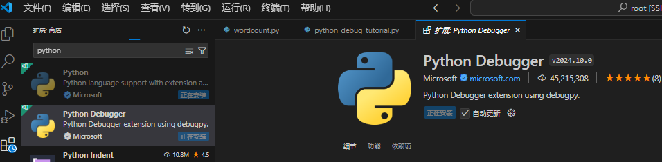
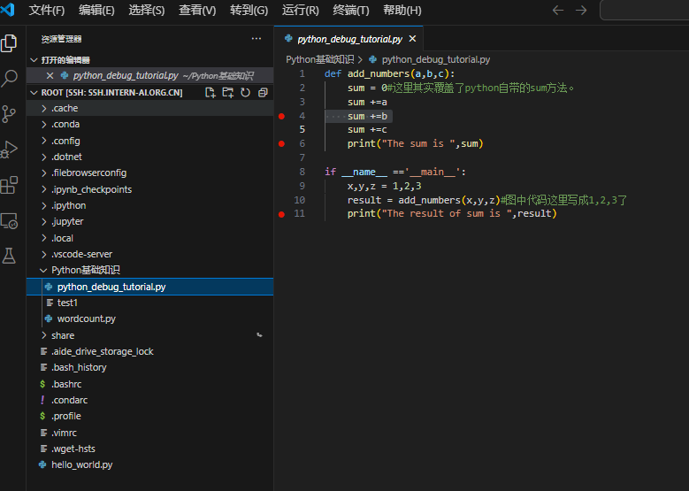
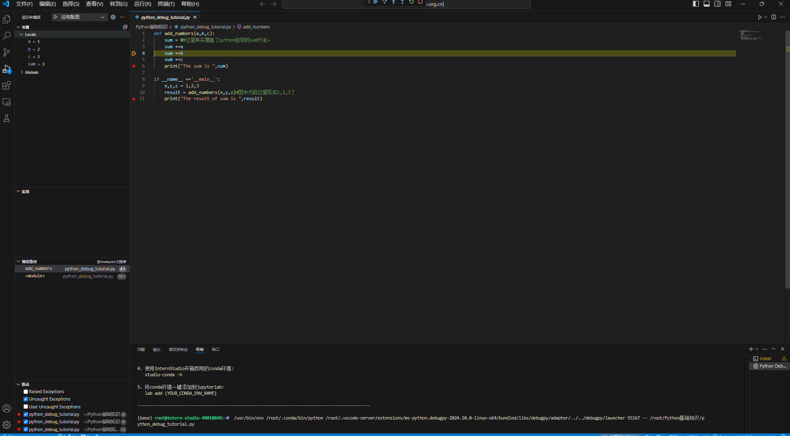
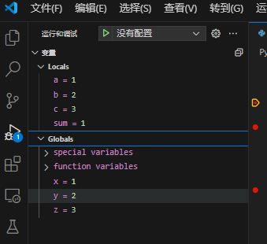
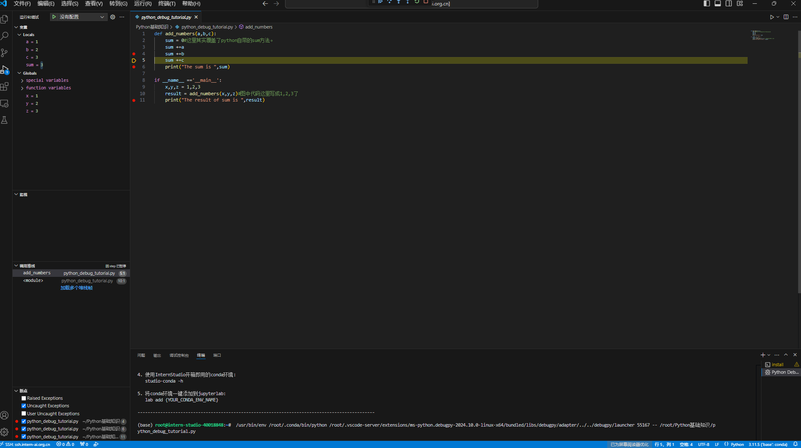
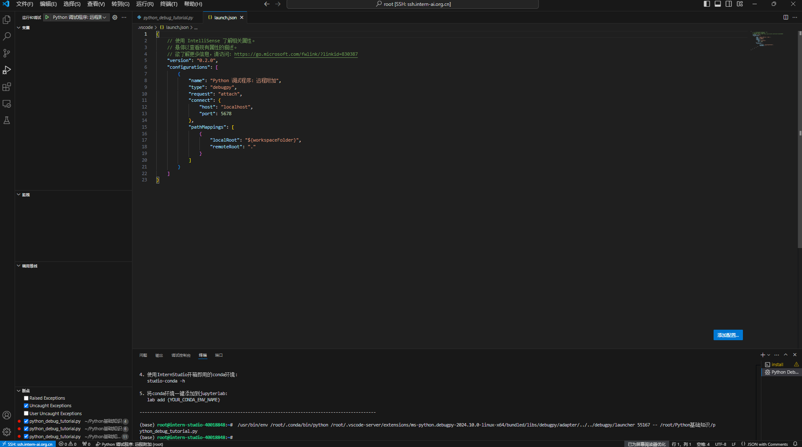
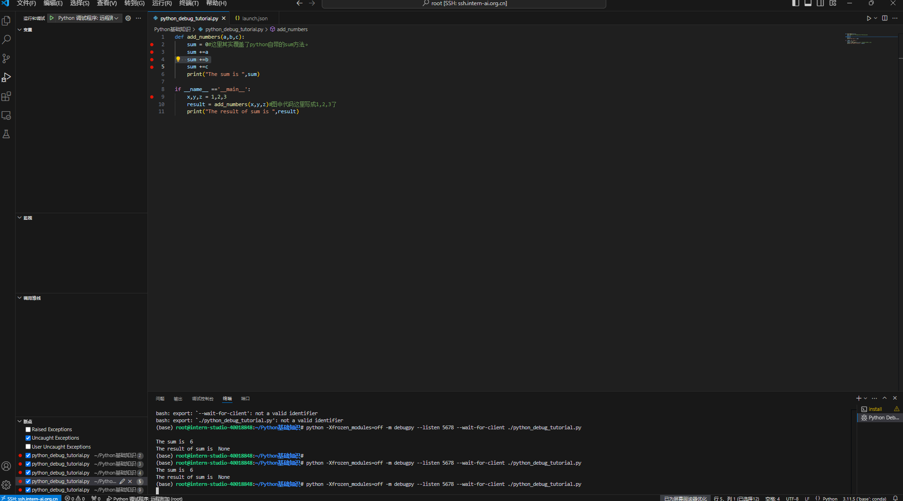

# Python 基础知识

## 1. Python实现wordcount

### 1.1. 代码实现

```python
# -*- coding: utf-8 -*-
import re
from collections import Counter

def word_count(file_path):
    # 读取文件内容
    with open(file_path, 'r', encoding='utf-8') as file:
        text = file.read()
    
    # 使用正则表达式去除标点符号并将文本转为小写
    words = re.findall(r'\b\w+\b', text.lower())
    
    # 统计词频
    word_counts = Counter(words)
    
    return word_counts

def print_word_count(word_counts):
    for word, count in word_counts.items():
        print(f'{word}: {count}')

if __name__ == '__main__':
    file_path = 'your_text_file.txt'  # 替换为你的文件路径
    word_counts = word_count(file_path)
    print_word_count(word_counts)
```

### 1.2. 测试实例

```text
Got this panda plush toy for my daughter's birthday,
who loves it and takes it everywhere. It's soft and
super cute, and its face has a friendly look. It's
a bit small for what I paid though. I think there
might be other options that are bigger for the
same price. It arrived a day earlier than expected,
so I got to play with it myself before I gave it
to her.
```

### 1.3. 运行结果

```shell
got: 2
this: 1
panda: 1
plush: 1
toy: 1
for: 3
my: 1
daughter: 1
s: 3
birthday: 1
who: 1
loves: 1
it: 7
and: 3
takes: 1
everywhere: 1
soft: 1
super: 1
cute: 1
its: 1
face: 1
has: 1
a: 3
friendly: 1
look: 1
bit: 1
small: 1
what: 1
i: 4
paid: 1
though: 1
think: 1
there: 1
might: 1
be: 1
other: 1
options: 1
that: 1
are: 1
bigger: 1
the: 1
same: 1
price: 1
arrived: 1
day: 1
earlier: 1
than: 1
expected: 1
so: 1
to: 2
play: 1
with: 1
myself: 1
before: 1
gave: 1
her: 1
```

## 2. Vscode连接InternStudio debug笔记

### 2.1. 安装Python插件



### 2.2. 设置断点



### 2.3. 运行调试



### 2.4. 查看变量



### 2.5. 单步执行代码



### 2.6. 在vscode使用命令行进行debug

在调试界面选择create a lauch.json file，选择debugger时选择python debuger,选择debug config时选择remote attach,接着一路回车即可，下面为json配置文件界面截图。



在命令行中输入`python -m debugpy --listen 5678 --wait-for-client ./python_debug_tutorial.py`，然后在vscode中启动debug。下面是命令行debug启动以及结果的截图。


