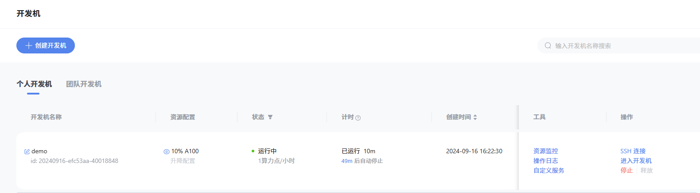
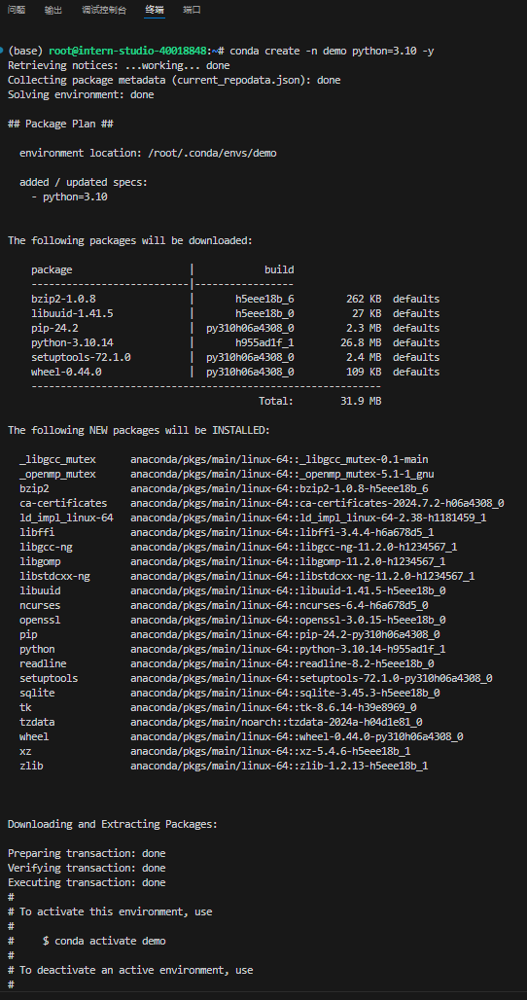
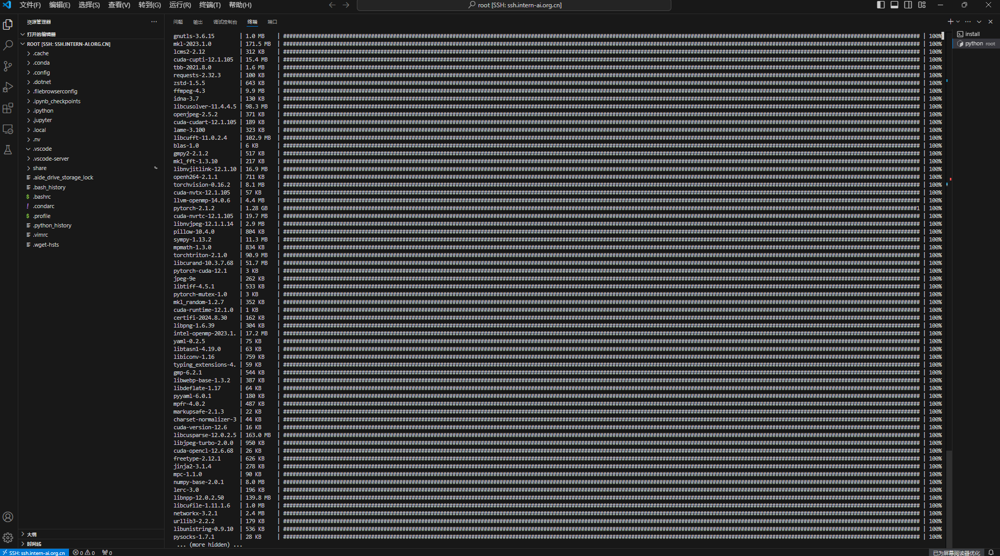

# 8G 显存玩转书生大模型 Demo

## 1. InternLM2-Chat-1.8B 模型的部署（基础任务）

### 1.1. 创建开发机



### 1.2. 环境配置、

- 创建 demo 环境，输入`conda create -n demo python=3.10 -y`，输出如下：



- 激活 demo 环境，并安装相关依赖想，输出如下：



### 1.3. Cli Demo 部署 InternLM2-Chat-1.8B 模型

- 创建cli_demo.py文件，输入以下代码：

```python
import torch
from transformers import AutoTokenizer, AutoModelForCausalLM

model_name_or_path = "/root/share/new_models/Shanghai_AI_Laboratory/internlm2-chat-1_8b"

# 加载模型和分词器
tokenizer = AutoTokenizer.from_pretrained(model_name_or_path, trust_remote_code=True, device_map='cuda:0')
model = AutoModelForCausalLM.from_pretrained(model_name_or_path, trust_remote_code=True, torch_dtype=torch.bfloat16, device_map='cuda:0')

# 设置模型为评估模式
model = model.eval()

# 与模型交互
system_prompt = """You are an AI assistant whose name is InternLM (书生·浦语).
- InternLM (书生·浦语) is a conversational language model that is developed by Shanghai AI Laboratory (上海人工智能实验室). It is designed to be helpful, honest, and harmless.
- InternLM (书生·浦语) can understand and communicate fluently in the language chosen by the user such as English and 中文.
"""

messages = [(system_prompt, '')]

print("=============Welcome to InternLM chatbot, type 'exit' to exit.=============")

while True:
    input_text = input("\nUser  >>> ")
    input_text = input_text.replace(' ', '')
    if input_text == "exit":
        break

    length = 0
    for response, _ in model.stream_chat(tokenizer, input_text, messages):
        if response is not None:
            print(response[length:], flush=True, end="")
            length = len(response)
```

- 输入`python /root/demo/cli_demo.py`运行cli_demo.py文件，输出如下：


### 1.4. Streamlit Web Demo 部署 InternLM2-Chat-1.8B 模型

- 教程仓库 clone 到本地，输入`git clone https://github.com/InternLM/Tutorial.git`，输出如下：


- 执行`streamlit run /root/demo/Tutorial/tools/streamlit_demo.py --server.address 127.0.0.1 --server.port 6006`来启动一个 Streamlit 服务，并通过 VScode 将端口映射到本地，通过浏览器访问 <http://localhost:6006> 来启动我们的 Demo。


- 浏览器访问 <http://localhost:6006>，输出如下：


## 2. LMDeploy 部署 InternLM-XComposer2-VL-1.8B 模型（进阶任务）

### 2.1. 环境配置

- 在原有的 demo 环境中，安装 LMDeploy以及其他依赖项，输入如下：

```bash
conda activate demo
 pip install lmdeploy[all]==0.5.1
 pip install timm==1.0.7
```

### 2.2. LMDeploy 启动与 InternLM-XComposer2-VL-1.8B 模型交互的 Gradio 服务

- 输入`lmdeploy serve gradio /share/new_models/Shanghai_AI_Laboratory/internlm-xcomposer2-vl-1_8b --cache-max-entry-count 0.1`，同样进行端口映射，输出如下：


- 浏览器访问 <http://localhost:6006>，输出如下：


## 3. LMDeploy 部署 InternVL2-2B 模型（进阶任务）

### 3.1. 启动 InternVL2-2B 模型的 Gradio 服务

- 输入`lmdeploy serve gradio /share/new_models/OpenGVLab/InternVL2-2B --cache-max-entry-count 0.1`，同样进行端口映射，输出如下：


- 浏览器访问 <http://localhost:6006>，输出如下：


完整回答为：

这张图片展示了一个充满活力和色彩的场景。图片中有三个人物，他们似乎正在进行某种战斗或展示技能。

左边的角色是穿着粉色和黑色服装的，她的头发是粉色的，并且戴着金色的小饰物。她正在做出一个胜利的手势，右手举起，似乎在庆祝或展示某种技能。

中间的角色穿着白色的服装，头发是深色的，戴着类似皇冠的头饰。她手持一把长剑，剑刃上似乎有某种发光的图案。

右边的角色穿着深蓝色的服装，头发是金色的，同样戴着类似皇冠的头饰。她双手交叉，似乎在观察或准备应对什么。

背景是一个充满绿色植物和传统建筑的地方，还有一些瀑布和石头，营造出一种宁静而神秘的氛围。整个场景充满了幻想和战斗的元素，给人一种冒险和探索的感觉。
