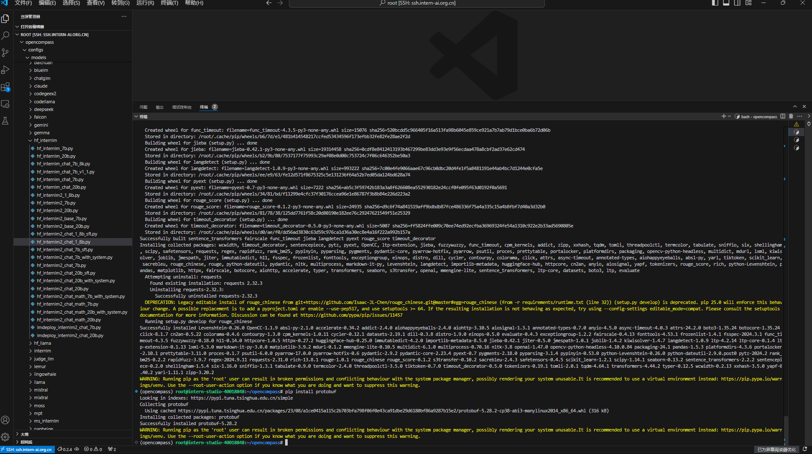
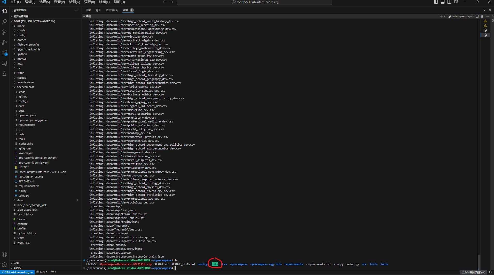
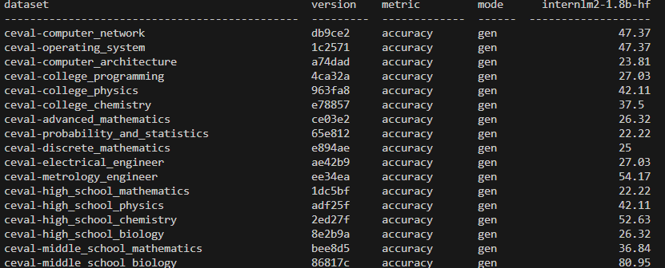
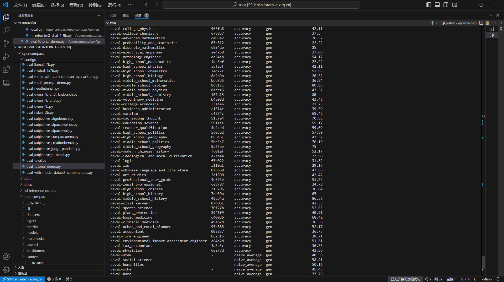

# OpenCompass 评测 InternLM-1.8B 实践

<!-- 进度：只需运行两次测评 2024/9/21/10：43 -->
<!-- 进度：完成 2024/9/23/10：43 -->

## 1. 基础任务

### 1.1. 任务概述

- 使用 OpenCompass 评测 internlm2-chat-1.8b 模型在 ceval 数据集上的性能，记录复现过程并截图。

### 1.2. 复现过程

#### 1.2.1. 环境准备

- 创建环境

```bash
# 创建虚拟环境
conda create -n opencompass python=3.10
conda activate opencompass
conda install pytorch==2.1.2 torchvision==0.16.2 torchaudio==2.1.2 pytorch-cuda=12.1 -c pytorch -c nvidia -y

# 安装 OpenCompass
cd /root
git clone -b 0.2.4 https://github.com/open-compass/opencompass
cd opencompass
pip install -e .
apt-get update
apt-get install cmake
pip install -r requirements.txt
pip install protobuf
```

- 结果截图



- 下载数据集

```bash
cp /share/temp/datasets/OpenCompassData-core-20231110.zip /root/opencompass/
unzip OpenCompassData-core-20231110.zip
```

- 结果截图



#### 1.2.2. 使用命令行配置参数法进行评测

打开`opencompass`文件夹下`configs/models/hf_internlm/的hf_internlm2_chat_1_8b.py`,贴入以下代码

```python
from opencompass.models import HuggingFaceCausalLM


models = [
    dict(
        type=HuggingFaceCausalLM,
        abbr='internlm2-1.8b-hf',
        path="/share/new_models/Shanghai_AI_Laboratory/internlm2-chat-1_8b",
        tokenizer_path='/share/new_models/Shanghai_AI_Laboratory/internlm2-chat-1_8b',
        model_kwargs=dict(
            trust_remote_code=True,
            device_map='auto',
        ),
        tokenizer_kwargs=dict(
            padding_side='left',
            truncation_side='left',
            use_fast=False,
            trust_remote_code=True,
        ),
        max_out_len=100,
        min_out_len=1,
        max_seq_len=2048,
        batch_size=8,
        run_cfg=dict(num_gpus=1, num_procs=1),
    )
]
```

- 启动测评

```bash
#环境变量配置
export MKL_SERVICE_FORCE_INTEL=1
#或
export MKL_THREADING_LAYER=GNU

# 运行评测
python run.py --datasets ceval_gen --models hf_internlm2_chat_1_8b --debug
```

- 查看评测结果(部分)



#### 1.2.3. 使用配置文件修改参数法进行评测

- 创建配置文件

```bash
# 创建配置文件
cd /root/opencompass/configs
touch eval_tutorial_demo.py
```

- py文件内容如下：

```python
# eval_tutorial_demo.py
from mmengine.config import read_base

with read_base():
    from .datasets.ceval.ceval_gen import ceval_datasets
    from .models.hf_internlm.hf_internlm2_chat_1_8b import models as hf_internlm2_chat_1_8b_models

datasets = ceval_datasets
models = hf_internlm2_chat_1_8b_models
```

- 启动测评

```bash
# 运行评测
cd /root/opencompass
python run.py configs/eval_tutorial_demo.py --debug
```

- 查看评测结果



## 2. 进阶任务（未完成）

### 2.1. 任务概述

- 使用 OpenCompass 进行主观评测（选做）
- 使用 OpenCompass 评测 InternLM2-Chat-1.8B 模型使用 LMDeploy部署后在 ceval 数据集上的性能（选做）
- 使用 OpenCompass 进行调用API评测（优秀学员必做）

## 3. 附件

- 命令行配置参数法评测完整结果文件：

```txt
20240923_083857
tabulate format
^^^^^^^^^^^^^^^^^^^^^^^^^^^^^^^^^^^^^^^^^^^^^^^^^^^^^^^^^^^^^^^^^^^^^^^^^^^^^^^^^^^^^^^^^^^^^^^^^^^^^^^^^^^^^^^^^^^^^^^^^^^^^^^^
dataset                                         version    metric         mode      internlm2-1.8b-hf
----------------------------------------------  ---------  -------------  ------  -------------------
ceval-computer_network                          db9ce2     accuracy       gen                   47.37
ceval-operating_system                          1c2571     accuracy       gen                   47.37
ceval-computer_architecture                     a74dad     accuracy       gen                   23.81
ceval-college_programming                       4ca32a     accuracy       gen                   27.03
ceval-college_physics                           963fa8     accuracy       gen                   42.11
ceval-college_chemistry                         e78857     accuracy       gen                   37.5
ceval-advanced_mathematics                      ce03e2     accuracy       gen                   26.32
ceval-probability_and_statistics                65e812     accuracy       gen                   22.22
ceval-discrete_mathematics                      e894ae     accuracy       gen                   25
ceval-electrical_engineer                       ae42b9     accuracy       gen                   27.03
ceval-metrology_engineer                        ee34ea     accuracy       gen                   54.17
ceval-high_school_mathematics                   1dc5bf     accuracy       gen                   22.22
ceval-high_school_physics                       adf25f     accuracy       gen                   42.11
ceval-high_school_chemistry                     2ed27f     accuracy       gen                   52.63
ceval-high_school_biology                       8e2b9a     accuracy       gen                   26.32
ceval-middle_school_mathematics                 bee8d5     accuracy       gen                   36.84
ceval-middle_school_biology                     86817c     accuracy       gen                   80.95
ceval-middle_school_physics                     8accf6     accuracy       gen                   47.37
ceval-middle_school_chemistry                   167a15     accuracy       gen                   80
ceval-veterinary_medicine                       b4e08d     accuracy       gen                   43.48
ceval-college_economics                         f3f4e6     accuracy       gen                   32.73
ceval-business_administration                   c1614e     accuracy       gen                   39.39
ceval-marxism                                   cf874c     accuracy       gen                   68.42
ceval-mao_zedong_thought                        51c7a4     accuracy       gen                   70.83
ceval-education_science                         591fee     accuracy       gen                   55.17
ceval-teacher_qualification                     4e4ced     accuracy       gen                   59.09
ceval-high_school_politics                      5c0de2     accuracy       gen                   57.89
ceval-high_school_geography                     865461     accuracy       gen                   47.37
ceval-middle_school_politics                    5be3e7     accuracy       gen                   76.19
ceval-middle_school_geography                   8a63be     accuracy       gen                   75
ceval-modern_chinese_history                    fc01af     accuracy       gen                   52.17
ceval-ideological_and_moral_cultivation         a2aa4a     accuracy       gen                   73.68
ceval-logic                                     f5b022     accuracy       gen                   31.82
ceval-law                                       a110a1     accuracy       gen                   29.17
ceval-chinese_language_and_literature           0f8b68     accuracy       gen                   47.83
ceval-art_studies                               2a1300     accuracy       gen                   42.42
ceval-professional_tour_guide                   4e673e     accuracy       gen                   51.72
ceval-legal_professional                        ce8787     accuracy       gen                   34.78
ceval-high_school_chinese                       315705     accuracy       gen                   36.84
ceval-high_school_history                       7eb30a     accuracy       gen                   65
ceval-middle_school_history                     48ab4a     accuracy       gen                   86.36
ceval-civil_servant                             87d061     accuracy       gen                   42.55
ceval-sports_science                            70f27b     accuracy       gen                   52.63
ceval-plant_protection                          8941f9     accuracy       gen                   40.91
ceval-basic_medicine                            c409d6     accuracy       gen                   68.42
ceval-clinical_medicine                         49e82d     accuracy       gen                   36.36
ceval-urban_and_rural_planner                   95b885     accuracy       gen                   52.17
ceval-accountant                                002837     accuracy       gen                   36.73
ceval-fire_engineer                             bc23f5     accuracy       gen                   38.71
ceval-environmental_impact_assessment_engineer  c64e2d     accuracy       gen                   51.61
ceval-tax_accountant                            3a5e3c     accuracy       gen                   36.73
ceval-physician                                 6e277d     accuracy       gen                   42.86
ceval-stem                                      -          naive_average  gen                   40.59
ceval-social-science                            -          naive_average  gen                   58.21
ceval-humanities                                -          naive_average  gen                   50.16
ceval-other                                     -          naive_average  gen                   45.43
ceval-hard                                      -          naive_average  gen                   33.76
ceval                                           -          naive_average  gen                   47.03
$$$$$$$$$$$$$$$$$$$$$$$$$$$$$$$$$$$$$$$$$$$$$$$$$$$$$$$$$$$$$$$$$$$$$$$$$$$$$$$$$$$$$$$$$$$$$$$$$$$$$$$$$$$$$$$$$$$$$$$$$$$$$$$$

-------------------------------------------------------------------------------------------------------------------------------- THIS IS A DIVIDER --------------------------------------------------------------------------------------------------------------------------------

csv format
^^^^^^^^^^^^^^^^^^^^^^^^^^^^^^^^^^^^^^^^^^^^^^^^^^^^^^^^^^^^^^^^^^^^^^^^^^^^^^^^^^^^^^^^^^^^^^^^^^^^^^^^^^^^^^^^^^^^^^^^^^^^^^^^
dataset,version,metric,mode,internlm2-1.8b-hf
ceval-computer_network,db9ce2,accuracy,gen,47.37
ceval-operating_system,1c2571,accuracy,gen,47.37
ceval-computer_architecture,a74dad,accuracy,gen,23.81
ceval-college_programming,4ca32a,accuracy,gen,27.03
ceval-college_physics,963fa8,accuracy,gen,42.11
ceval-college_chemistry,e78857,accuracy,gen,37.50
ceval-advanced_mathematics,ce03e2,accuracy,gen,26.32
ceval-probability_and_statistics,65e812,accuracy,gen,22.22
ceval-discrete_mathematics,e894ae,accuracy,gen,25.00
ceval-electrical_engineer,ae42b9,accuracy,gen,27.03
ceval-metrology_engineer,ee34ea,accuracy,gen,54.17
ceval-high_school_mathematics,1dc5bf,accuracy,gen,22.22
ceval-high_school_physics,adf25f,accuracy,gen,42.11
ceval-high_school_chemistry,2ed27f,accuracy,gen,52.63
ceval-high_school_biology,8e2b9a,accuracy,gen,26.32
ceval-middle_school_mathematics,bee8d5,accuracy,gen,36.84
ceval-middle_school_biology,86817c,accuracy,gen,80.95
ceval-middle_school_physics,8accf6,accuracy,gen,47.37
ceval-middle_school_chemistry,167a15,accuracy,gen,80.00
ceval-veterinary_medicine,b4e08d,accuracy,gen,43.48
ceval-college_economics,f3f4e6,accuracy,gen,32.73
ceval-business_administration,c1614e,accuracy,gen,39.39
ceval-marxism,cf874c,accuracy,gen,68.42
ceval-mao_zedong_thought,51c7a4,accuracy,gen,70.83
ceval-education_science,591fee,accuracy,gen,55.17
ceval-teacher_qualification,4e4ced,accuracy,gen,59.09
ceval-high_school_politics,5c0de2,accuracy,gen,57.89
ceval-high_school_geography,865461,accuracy,gen,47.37
ceval-middle_school_politics,5be3e7,accuracy,gen,76.19
ceval-middle_school_geography,8a63be,accuracy,gen,75.00
ceval-modern_chinese_history,fc01af,accuracy,gen,52.17
ceval-ideological_and_moral_cultivation,a2aa4a,accuracy,gen,73.68
ceval-logic,f5b022,accuracy,gen,31.82
ceval-law,a110a1,accuracy,gen,29.17
ceval-chinese_language_and_literature,0f8b68,accuracy,gen,47.83
ceval-art_studies,2a1300,accuracy,gen,42.42
ceval-professional_tour_guide,4e673e,accuracy,gen,51.72
ceval-legal_professional,ce8787,accuracy,gen,34.78
ceval-high_school_chinese,315705,accuracy,gen,36.84
ceval-high_school_history,7eb30a,accuracy,gen,65.00
ceval-middle_school_history,48ab4a,accuracy,gen,86.36
ceval-civil_servant,87d061,accuracy,gen,42.55
ceval-sports_science,70f27b,accuracy,gen,52.63
ceval-plant_protection,8941f9,accuracy,gen,40.91
ceval-basic_medicine,c409d6,accuracy,gen,68.42
ceval-clinical_medicine,49e82d,accuracy,gen,36.36
ceval-urban_and_rural_planner,95b885,accuracy,gen,52.17
ceval-accountant,002837,accuracy,gen,36.73
ceval-fire_engineer,bc23f5,accuracy,gen,38.71
ceval-environmental_impact_assessment_engineer,c64e2d,accuracy,gen,51.61
ceval-tax_accountant,3a5e3c,accuracy,gen,36.73
ceval-physician,6e277d,accuracy,gen,42.86
ceval-stem,-,naive_average,gen,40.59
ceval-social-science,-,naive_average,gen,58.21
ceval-humanities,-,naive_average,gen,50.16
ceval-other,-,naive_average,gen,45.43
ceval-hard,-,naive_average,gen,33.76
ceval,-,naive_average,gen,47.03
$$$$$$$$$$$$$$$$$$$$$$$$$$$$$$$$$$$$$$$$$$$$$$$$$$$$$$$$$$$$$$$$$$$$$$$$$$$$$$$$$$$$$$$$$$$$$$$$$$$$$$$$$$$$$$$$$$$$$$$$$$$$$$$$

-------------------------------------------------------------------------------------------------------------------------------- THIS IS A DIVIDER --------------------------------------------------------------------------------------------------------------------------------

raw format
^^^^^^^^^^^^^^^^^^^^^^^^^^^^^^^^^^^^^^^^^^^^^^^^^^^^^^^^^^^^^^^^^^^^^^^^^^^^^^^^^^^^^^^^^^^^^^^^^^^^^^^^^^^^^^^^^^^^^^^^^^^^^^^^
-------------------------------
Model: internlm2-1.8b-hf
ceval-computer_network: {'accuracy': 47.368421052631575}
ceval-operating_system: {'accuracy': 47.368421052631575}
ceval-computer_architecture: {'accuracy': 23.809523809523807}
ceval-college_programming: {'accuracy': 27.027027027027028}
ceval-college_physics: {'accuracy': 42.10526315789473}
ceval-college_chemistry: {'accuracy': 37.5}
ceval-advanced_mathematics: {'accuracy': 26.31578947368421}
ceval-probability_and_statistics: {'accuracy': 22.22222222222222}
ceval-discrete_mathematics: {'accuracy': 25.0}
ceval-electrical_engineer: {'accuracy': 27.027027027027028}
ceval-metrology_engineer: {'accuracy': 54.166666666666664}
ceval-high_school_mathematics: {'accuracy': 22.22222222222222}
ceval-high_school_physics: {'accuracy': 42.10526315789473}
ceval-high_school_chemistry: {'accuracy': 52.63157894736842}
ceval-high_school_biology: {'accuracy': 26.31578947368421}
ceval-middle_school_mathematics: {'accuracy': 36.84210526315789}
ceval-middle_school_biology: {'accuracy': 80.95238095238095}
ceval-middle_school_physics: {'accuracy': 47.368421052631575}
ceval-middle_school_chemistry: {'accuracy': 80.0}
ceval-veterinary_medicine: {'accuracy': 43.47826086956522}
ceval-college_economics: {'accuracy': 32.72727272727273}
ceval-business_administration: {'accuracy': 39.39393939393939}
ceval-marxism: {'accuracy': 68.42105263157895}
ceval-mao_zedong_thought: {'accuracy': 70.83333333333334}
ceval-education_science: {'accuracy': 55.172413793103445}
ceval-teacher_qualification: {'accuracy': 59.09090909090909}
ceval-high_school_politics: {'accuracy': 57.89473684210527}
ceval-high_school_geography: {'accuracy': 47.368421052631575}
ceval-middle_school_politics: {'accuracy': 76.19047619047619}
ceval-middle_school_geography: {'accuracy': 75.0}
ceval-modern_chinese_history: {'accuracy': 52.17391304347826}
ceval-ideological_and_moral_cultivation: {'accuracy': 73.68421052631578}
ceval-logic: {'accuracy': 31.818181818181817}
ceval-law: {'accuracy': 29.166666666666668}
ceval-chinese_language_and_literature: {'accuracy': 47.82608695652174}
ceval-art_studies: {'accuracy': 42.42424242424242}
ceval-professional_tour_guide: {'accuracy': 51.724137931034484}
ceval-legal_professional: {'accuracy': 34.78260869565217}
ceval-high_school_chinese: {'accuracy': 36.84210526315789}
ceval-high_school_history: {'accuracy': 65.0}
ceval-middle_school_history: {'accuracy': 86.36363636363636}
ceval-civil_servant: {'accuracy': 42.5531914893617}
ceval-sports_science: {'accuracy': 52.63157894736842}
ceval-plant_protection: {'accuracy': 40.909090909090914}
ceval-basic_medicine: {'accuracy': 68.42105263157895}
ceval-clinical_medicine: {'accuracy': 36.36363636363637}
ceval-urban_and_rural_planner: {'accuracy': 52.17391304347826}
ceval-accountant: {'accuracy': 36.734693877551024}
ceval-fire_engineer: {'accuracy': 38.70967741935484}
ceval-environmental_impact_assessment_engineer: {'accuracy': 51.61290322580645}
ceval-tax_accountant: {'accuracy': 36.734693877551024}
ceval-physician: {'accuracy': 42.857142857142854}
ceval-stem: {'naive_average': 40.59131917141071}
ceval-social-science: {'naive_average': 58.209255505535}
ceval-humanities: {'naive_average': 50.16416269898978}
ceval-other: {'naive_average': 45.427415876538255}
ceval-hard: {'naive_average': 33.76279239766082}
ceval: {'naive_average': 47.027428900276384}
$$$$$$$$$$$$$$$$$$$$$$$$$$$$$$$$$$$$$$$$$$$$$$$$$$$$$$$$$$$$$$$$$$$$$$$$$$$$$$$$$$$$$$$$$$$$$$$$$$$$$$$$$$$$$$$$$$$$$$$$$$$$$$$$
```