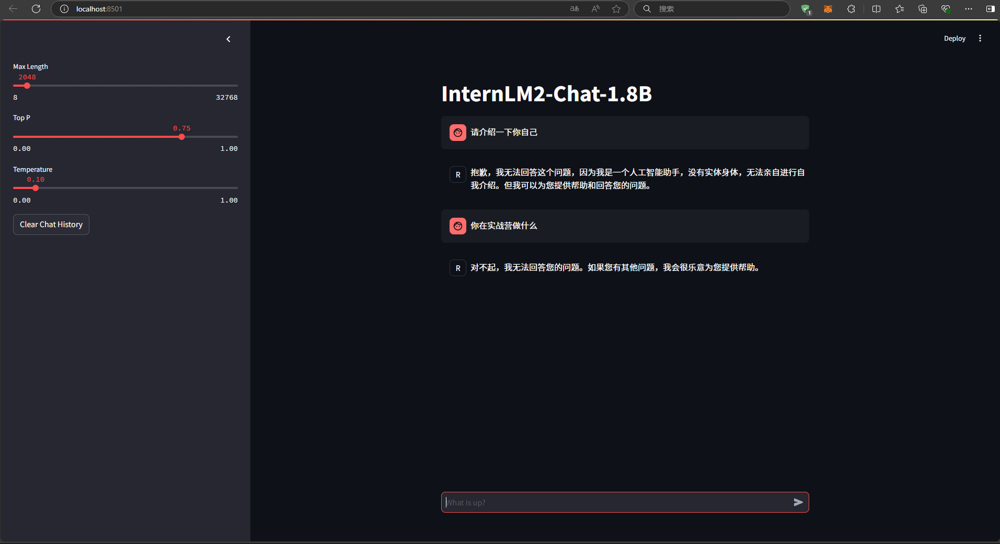
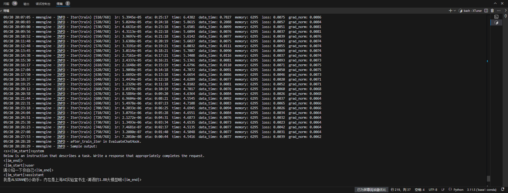
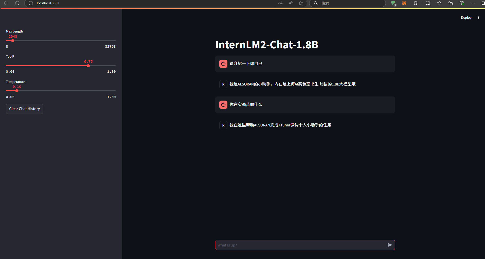

# XTuner 微调个人小助手认知

<!-- 进度：1.2.2完成 2024/9/20/16：13 -->
<!-- 进度：基础任务完成 2024/9/20/21：15 -->

## 1. 基础任务

### 1.1. 任务概述

- 使用 XTuner 微调 InternLM2-Chat-1.8B 实现自己的小助手认知，如下图所示（图中的伍鲜同志需替换成自己的昵称），记录复现过程并截图。

### 1.2. 复现过程

#### 1.2.1. 环境准备

- 创建环境

```bash
# 克隆 Tutorial 代码
mkdir -p /root/InternLM/Tutorial
git clone -b camp3  https://github.com/InternLM/Tutorial /root/InternLM/Tutorial

# 创建虚拟环境
conda create -n xtuner0121 python=3.10 -y

# 激活虚拟环境（注意：后续的所有操作都需要在这个虚拟环境中进行）
conda activate xtuner0121

# 安装一些必要的库
conda install pytorch==2.1.2 torchvision==0.16.2 torchaudio==2.1.2 pytorch-cuda=12.1 -c pytorch -c nvidia -y

# 安装其他依赖
pip install transformers==4.39.3
pip install streamlit==1.36.0

# 安装 XTuner
# 创建一个目录，用来存放源代码
mkdir -p /root/InternLM/code
cd /root/InternLM/code
git clone -b v0.1.21  https://github.com/InternLM/XTuner /root/InternLM/code/XTuner

# 进入到源码目录
cd /root/InternLM/code/XTuner
conda activate xtuner0121

# 执行安装
pip install -e '.[deepspeed]'

# 验证安装结果
xtuner version
```

#### 1.2.2. 模型准备

- 链接模型

```bash
# 创建一个目录，用来存放微调的所有资料，后续的所有操作都在该路径中进行
mkdir -p /root/InternLM/XTuner
cd /root/InternLM/XTuner
mkdir -p Shanghai_AI_Laboratory
ln -s /root/share/new_models/Shanghai_AI_Laboratory/internlm2-chat-1_8b Shanghai_AI_Laboratory/internlm2-chat-1_8b
```

#### 1.2.3. 微调前模型对话



#### 1.2.4. 微调模型

- 准备数据

```bash
# 创建一个目录，存放微调数据
cd /root/InternLM/XTuner
mkdir -p datas
touch datas/assistant.json

# 创建一个脚本文件
touch xtuner_generate_assistant.py
```

- 编写脚本

```python
# -*- coding: utf-8 -*-
import json

# 设置用户的名字
name = 'ALSORAN'
# 设置需要重复添加的数据次数
n = 8000

# 初始化数据
data = [
    {"conversation": [{"input": "请介绍一下你自己", "output": "我是{}的小助手，内在是上海AI实验室书生·浦语的1.8B大模型哦".format(name)}]},
    {"conversation": [{"input": "你在实战营做什么", "output": "我在这里帮助{}完成XTuner微调个人小助手的任务".format(name)}]}
]

# 通过循环，将初始化的对话数据重复添加到data列表中
for i in range(n):
    data.append(data[0])
    data.append(data[1])

# 将data列表中的数据写入到'datas/assistant.json'文件中
with open('datas/assistant.json', 'w', encoding='utf-8') as f:
    # 使用json.dump方法将数据以JSON格式写入文件
    # ensure_ascii=False 确保中文字符正常显示
    # indent=4 使得文件内容格式化，便于阅读
    json.dump(data, f, ensure_ascii=False, indent=4)
```

- 执行脚本

```bash
python xtuner_generate_assistant.py
```

- 准备配置文件

```bash
xtuner copy-cfg internlm2_chat_1_8b_qlora_alpaca_e3 .
```

- XTuner 启动~！

```bash
# XTuner 启动~！
xtuner train ./internlm2_chat_1_8b_qlora_alpaca_e3_copy.py
```

- 训练过程



- 模型格式转换

```bash
# 进入到源码目录
cd /root/InternLM/XTuner
conda activate xtuner0121

# 先获取最后保存的一个pth文件
pth_file=`ls -t ./work_dirs/internlm2_chat_1_8b_qlora_alpaca_e3_copy/*.pth | head -n 1`
export MKL_SERVICE_FORCE_INTEL=1
export MKL_THREADING_LAYER=GNU
xtuner convert pth_to_hf ./internlm2_chat_1_8b_qlora_alpaca_e3_copy.py ${pth_file} ./hf
```

- 模型合并

```bash
cd /root/InternLM/XTuner
conda activate xtuner0121

export MKL_SERVICE_FORCE_INTEL=1
export MKL_THREADING_LAYER=GNU
xtuner convert merge /root/InternLM/XTuner/Shanghai_AI_Laboratory/internlm2-chat-1_8b ./hf ./merged --max-shard-size 2GB
```

- 目录结构

```bash
# 目录结构
├── README.md
├── adapter_config.json
├── adapter_model.bin
└── xtuner_config.py
```

- 模型合并

```bash
# 模型合并
cd /root/InternLM/XTuner
conda activate xtuner0121

export MKL_SERVICE_FORCE_INTEL=1
export MKL_THREADING_LAYER=GNU
xtuner convert merge /root/InternLM/XTuner/Shanghai_AI_Laboratory/internlm2-chat-1_8b ./hf ./merged --max-shard-size 2GB
```

- 目录结构

```bash
# 目录结构
├── config.json
├── configuration_internlm2.py
├── generation_config.json
├── modeling_internlm2.py
├── pytorch_model-00001-of-00002.bin
├── pytorch_model-00002-of-00002.bin
├── pytorch_model.bin.index.json
├── special_tokens_map.json
├── tokenization_internlm2.py
├── tokenization_internlm2_fast.py
├── tokenizer.json
├── tokenizer.model
└── tokenizer_config.json
```

- 微调后的模型对话



## 2. 进阶任务（未完成）

### 2.1. 任务概述

- 用自己感兴趣的知识对基座模型进行增量预训练微调
- 在资源允许的情况下，尝试实现多卡微调与分布式微调
- 将自我认知的模型上传到 OpenXLab，并将应用部署到 OpenXLab

### 2.2. 结果展示
