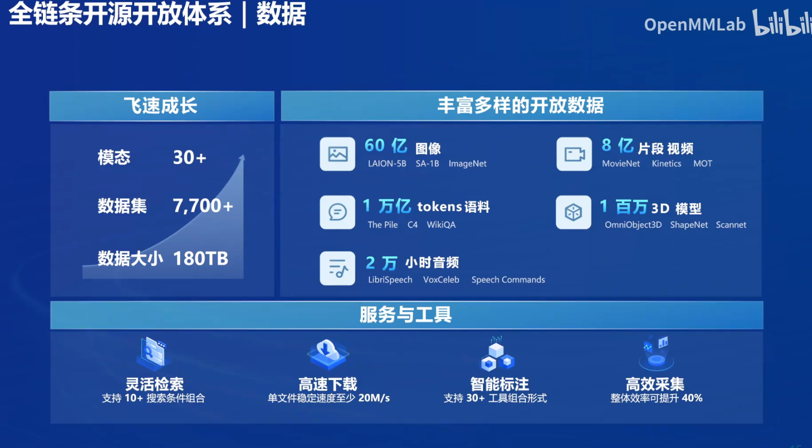
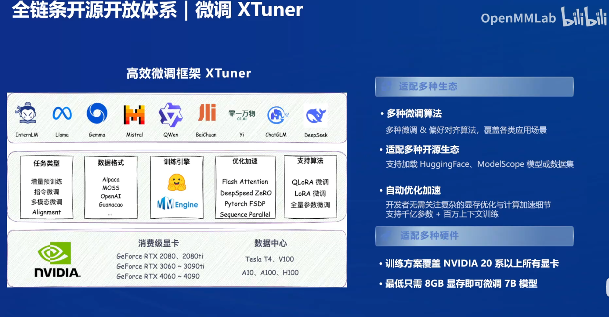
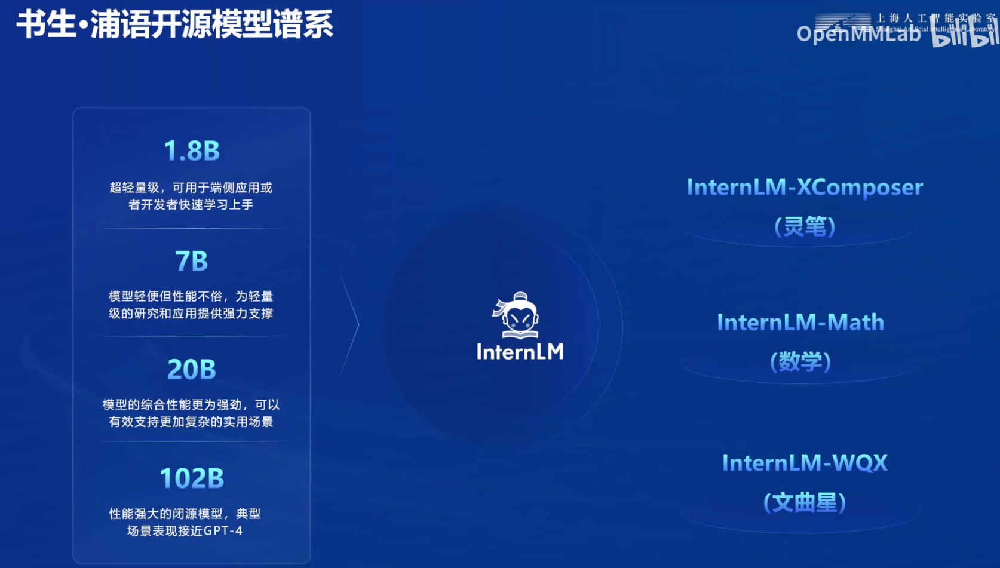
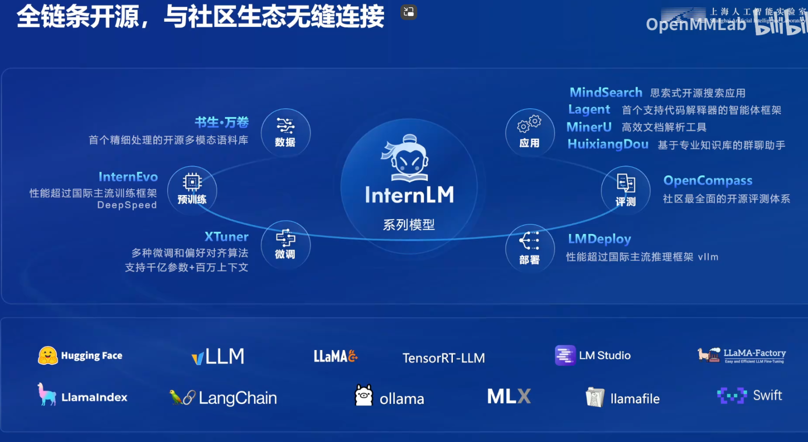

# 书生大模型全链路开源开放体系概述

## 书生浦语开源历程

### 主要里程碑

- **2023年7月6日**: 发布了7B模型，免费开源，支持商业使用，并推出了全链条开源工具体系。
- **2023年9月底**: 发布了20B模型，适用于中小企业及科研机构。
- **2024年1月**: 发布了Inter LM 2.0，性能超越其他同量级开源模型。
- **2024年7月初**: 发布了Inter LM 2.5，性能大幅提升。

### 性能天梯

书生浦语大模型在不断迭代中，其性能逐步接近GPT-4的水平。Inter LM 2.5模型在推理能力、上下文记忆和任务完成能力方面都有显著提升。例如，它在推理性能上提升了20%，能够处理长达一百万token的上下文信息。

## 开源体系概览

### 开源工具与框架

- **数据收集与整理**: 包括预训练语料库和标注工具。

- **模型训练与微调**: 提供了微调框架（如XTuner）。

- **模型评估**: 使用Open Compass等工具进行性能评测。

- **AI应用部署**: 包括LM Deploy等部署工具。

- **应用实例**: 提供了基于大语言模型的Mind Search搜索引擎。

### 模型系列

- **1.8B模型**: 适用于轻量级应用，如移动设备或边缘设备。
- **7B模型**: 适用于轻量级研究和应用。
- **20B模型**: 适用于生产环境，具有涌现现象。
- **102B模型**: 尚未开源。

### 多模态模型

- **Intern LM X Composer**: 处理图像和文本的多模态任务。
- **Intern LM Math**: 专注于数学问题的模型。
- **Intern LM 文曲星**: 专门用于高考题目的模型。

## 高质量数据生成与标注工具

### 数据生成策略

- **规则构造**: 基于规则的数据构造，如数学公式和代码。
- **模型扩充**: 使用现有模型进行数据扩充。
- **基于反馈的强化训练**: 通过人类反馈优化模型生成的结果。

### 开源标注工具

- **Label LLM**: 方便的NLP任务标注工具。
- **Label U**: 传统图像标注工具，支持视频标注。

