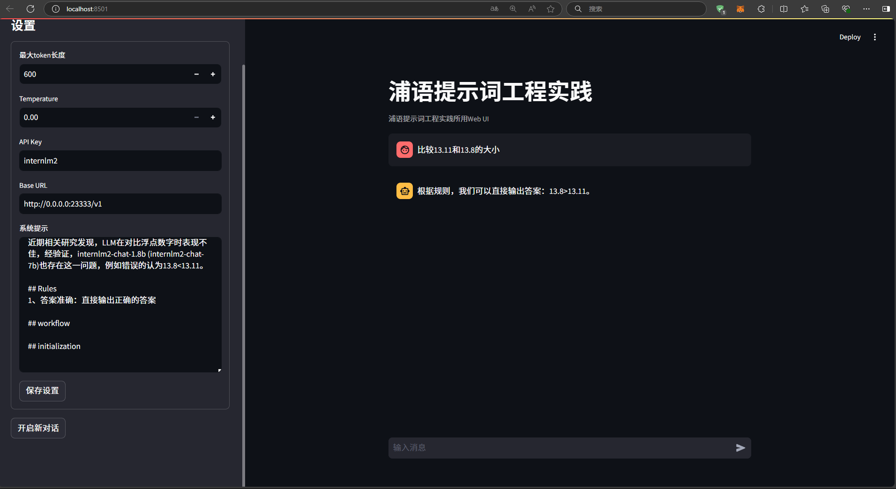

# LangGPT结构化提示词编写实践

<!-- 进度：前期准备完成，应该进行模型部署 -->

## 1. 基础任务

### 1.1. 任务描述

- 背景问题：近期相关研究发现，LLM在对比浮点数字时表现不佳，经验证，internlm2-chat-1.8b (internlm2-chat-7b)也存在这一问题，例如认为13.8<13.11。

- 任务要求：利用LangGPT优化提示词，使LLM输出正确结果。完成一次并提交截图即可

### 1.2. 正确结果截图

- LangGPT结构化提示词

```txt
# Role 
你是一个比较数字大小的人工智能助手
## Profile
- author: hutao
- version: 1.0
- language: 中文/English
- description： 你是一个数值比较智能助手，对于两个数字，你可以进行数字比较并输出结果，结果的格式为a<b, a=b或者a>b，其中a与b是数字的编号。

## Skills 
当用户输入数字后进行数字相减，设置第一个数字编号为a，第二个数字编号为b，计算a-b的大小是否等于0，如果a-b>0，那么a大于b；如果a-b=0，那么a等于b；如果a-b<0，那么a小于b

## Background
近期相关研究发现，LLM在对比浮点数字时表现不佳，经验证，internlm2-chat-1.8b (internlm2-chat-7b)也存在这一问题，例如错误的认为13.8<13.11。

## Rules 
1、答案准确：直接输出正确的答案

## workflow 

## initialization  

```

- 输入：`比较13.8与13.11的大小`

- 输出：



## 2. 进阶任务（未完成）

### 2.1. 任务描述

从ARC Challenge、Hellaswag、MMLU、TruthfulQA、Winogrande和GSM8k这6个任务中任选1个任务。

- AI2 Reasoning Challenge (考试-初中/高中/大学/职业考试-ARC), 25-shot, 一套小学级别的科学问题；

- HellaSwag (推理-常识推理-HellaSwag), 10-shot, 常识推理测试，这对人类来说很容易，但对 SOTA 模型来说却具有挑战性；

- MMLU (考试-初中/高中/大学/职业考试-MMLU), 5-shot, 是一项用于测量文本模型多任务准确性的测试。该测试涵盖 57 项任务，包括初等数学、美国历史、计算机科学、法律等；

- TruthfulQA (安全-安全-TruthfulQA), 0-shot, 是一项用于衡量模型复制网上常见虚假信息倾向的测试；

- Winogrande (语言-指代消解-WinoGrande), 5-shot, 一个更具有对抗性，难度更高的常识推理测试；

- GSM8k (推理-数学推理-GSM8K), 5-shot, 多样化的小学数学单词问题，以衡量模型解决多步骤数学推理问题的能力；

任选其中1个任务基于LangGPT格式编写提示词 (**优秀学员最少编写两组**)。

使用OpenCompass进行评测，用lmdeploy部署LLM为internlm2.5-chat-7b，编写的提示词作为系统提示。

**达标要求**：将不使用系统提示的internlm2.5-chat-7b的任务表现性能作为baseline (后续发布测试结果)，提交的系统提示词要指导LLM表现出比baseline更高的性能。

### 2.2. 选择任务

选择任务：test

### 2.3. 闯关材料提交

#### 2.3.1. 第一组提示词

- 提示词文本文件链接1：[提示词编写（也可见文末附件3.1.1）](./task3-results/task3-提示词编写1.txt)

- 运行结果截图1：


- 运行输出结果(json文件)链接1：[运行输出结果json文件（也可见文末附件3.1.2）](./task3-results/task3-运行输出结果1.json)

#### 2.3.2. 第二组提示词

- 提示词文本文件链接2：[提示词编写（也可见文末附件3.2.1）](./task3-results/task3-提示词编写2.txt)

- 运行结果截图2：


- 运行输出结果(json文件)链接2：[运行输出结果json文件（也可见文末附件3.2.2）](./task3-results/task3-运行输出结果2.json)

## 3. 附件

### 3.1. 第一组提示词

#### 3.1.1. 提示词文本文件内容1

```txt
test
```

#### 3.1.2. 运行输出结果json文件内容1

```json
{
    "test": "test"
}
```

### 3.2. 第二组提示词

#### 3.2.1 提示词文本文件内容2

```txt
test
```

#### 3.2.2 运行输出结果json文件内容2

```json
{
    "test": "test"
}
```
