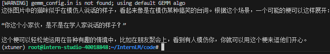

# InternVL 多模态模型部署微调实践

<!-- 进度：pip install -e '.[deepspeed]' line45 -->
<!-- 进度：4.1完成，进行4.2 -->

## 1. 任务简介

- follow 教学文档和视频使用QLoRA进行微调模型，复现微调效果，并能成功讲出梗图.
- 尝试使用LoRA，或调整xtuner的config，如LoRA rank，学习率。看模型Loss会如何变化，并记录调整后效果(选做，使用LoRA或调整config可以二选一)

## 2. 环境搭建

### 2.1. 准备InternVL模型

```bash
cd /root
mkdir -p model
cp -r /root/share/new_models/OpenGVLab/InternVL2-2B /root/model/
```

### 2.2. 准备环境

```bash
conda create --name xtuner python=3.10 -y

# 激活虚拟环境（注意：后续的所有操作都需要在这个虚拟环境中进行）
conda activate xtuner

# 安装一些必要的库
conda install pytorch==2.1.2 torchvision==0.16.2 torchaudio==2.1.2 pytorch-cuda=12.1 -c pytorch -c nvidia -y
# 安装其他依赖
apt install libaio-dev
pip install transformers==4.39.3
pip install streamlit==1.36.0
```

### 2.3. 安装xtuner

```bash
# 创建一个目录，用来存放源代码
mkdir -p /root/InternLM/code
cd /root/InternLM/code
git clone -b v0.1.23  https://github.com/InternLM/XTuner
# 安装xtuner环境
cd /root/InternLM/code/XTuner
pip install -e '.[deepspeed]'
pip install lmdeploy==0.5.3
```

### 2.4. 安装验证

```bash
# 验证xtuner是否安装成功
xtuner version
##命令
xtuner help
```

- 结果截图


## 3. 微调数据集准备

```bash
## 首先让我们安装一下需要的包
pip install datasets matplotlib Pillow timm

## 让我们把数据集挪出来
cp -r /root/share/new_models/datasets/CLoT_cn_2000 /root/InternLM/datasets/
```

- 看看第一张图片

```bash
cp InternLM/datasets/ex_images/007aPnLRgy1hb39z0im50j30ci0el0wm.jpg InternLM/
```

- 结果截图(可爱捏~)


- 看看第一张图片的标签

```json
  {
    "image": "ex_images/007aPnLRgy1hb39z0im50j30ci0el0wm.jpg",
    "conversations": [
      {
        "from": "human",
        "value": "<image>\n请你根据这张图片，讲一个脑洞大开的梗"
      },
      {
        "from": "gpt",
        "value": "『住手！现在的你还不是那家伙的对手！先撤吧！！"
      }
    ]
  },
```


## 4. InternVL 推理部署

### 4.1. 用pipeline进行推理

```bash
touch /root/InternLM/code/test_lmdeploy.py
cd /root/InternLM/code/
```

- 编辑`test_lmdeploy.py`

```python
from lmdeploy import pipeline
from lmdeploy.vl import load_image

pipe = pipeline('/root/model/InternVL2-2B')

image = load_image('/root/InternLM/007aPnLRgy1hb39z0im50j30ci0el0wm.jpg')
response = pipe(('请你根据这张图片，讲一个脑洞大开的梗', image))
print(response.text)
```

- 运行结果



### 4.2. InternVL 微调

#### 4.2.1. 配置微调参数

```python
# Copyright (c) OpenMMLab. All rights reserved.
from mmengine.hooks import (CheckpointHook, DistSamplerSeedHook, IterTimerHook,
                            LoggerHook, ParamSchedulerHook)
from mmengine.optim import AmpOptimWrapper, CosineAnnealingLR, LinearLR
from peft import LoraConfig
from torch.optim import AdamW
from transformers import AutoTokenizer

from xtuner.dataset import InternVL_V1_5_Dataset
from xtuner.dataset.collate_fns import default_collate_fn
from xtuner.dataset.samplers import LengthGroupedSampler
from xtuner.engine.hooks import DatasetInfoHook
from xtuner.engine.runner import TrainLoop
from xtuner.model import InternVL_V1_5
from xtuner.utils import PROMPT_TEMPLATE

#######################################################################
#                          PART 1  Settings                           #
#######################################################################
# Model
path = '/root/model/InternVL2-2B'

# Data
data_root = '/root/InternLM/datasets/CLoT_cn_2000/'
data_path = data_root + 'ex_cn.json'
image_folder = data_root
prompt_template = PROMPT_TEMPLATE.internlm2_chat
max_length = 6656

# Scheduler & Optimizer
batch_size = 4  # per_device
accumulative_counts = 4
dataloader_num_workers = 4
max_epochs = 6
optim_type = AdamW
# official 1024 -> 4e-5
lr = 2e-5
betas = (0.9, 0.999)
weight_decay = 0.05
max_norm = 1  # grad clip
warmup_ratio = 0.03

# Save
save_steps = 1000
save_total_limit = 1  # Maximum checkpoints to keep (-1 means unlimited)

#######################################################################
#            PART 2  Model & Tokenizer & Image Processor              #
#######################################################################
model = dict(
    type=InternVL_V1_5,
    model_path=path,
    freeze_llm=True,
    freeze_visual_encoder=True,
    quantization_llm=True,  # or False
    quantization_vit=False,  # or True and uncomment visual_encoder_lora
    # comment the following lines if you don't want to use Lora in llm
    llm_lora=dict(
        type=LoraConfig,
        r=128,
        lora_alpha=256,
        lora_dropout=0.05,
        target_modules=None,
        task_type='CAUSAL_LM'),
    # uncomment the following lines if you don't want to use Lora in visual encoder # noqa
    # visual_encoder_lora=dict(
    #     type=LoraConfig, r=64, lora_alpha=16, lora_dropout=0.05,
    #     target_modules=['attn.qkv', 'attn.proj', 'mlp.fc1', 'mlp.fc2'])
)

#######################################################################
#                      PART 3  Dataset & Dataloader                   #
#######################################################################
llava_dataset = dict(
    type=InternVL_V1_5_Dataset,
    model_path=path,
    data_paths=data_path,
    image_folders=image_folder,
    template=prompt_template,
    max_length=max_length)

train_dataloader = dict(
    batch_size=batch_size,
    num_workers=dataloader_num_workers,
    dataset=llava_dataset,
    sampler=dict(
        type=LengthGroupedSampler,
        length_property='modality_length',
        per_device_batch_size=batch_size * accumulative_counts),
    collate_fn=dict(type=default_collate_fn))

#######################################################################
#                    PART 4  Scheduler & Optimizer                    #
#######################################################################
# optimizer
optim_wrapper = dict(
    type=AmpOptimWrapper,
    optimizer=dict(
        type=optim_type, lr=lr, betas=betas, weight_decay=weight_decay),
    clip_grad=dict(max_norm=max_norm, error_if_nonfinite=False),
    accumulative_counts=accumulative_counts,
    loss_scale='dynamic',
    dtype='float16')

# learning policy
# More information: https://github.com/open-mmlab/mmengine/blob/main/docs/en/tutorials/param_scheduler.md  # noqa: E501
param_scheduler = [
    dict(
        type=LinearLR,
        start_factor=1e-5,
        by_epoch=True,
        begin=0,
        end=warmup_ratio * max_epochs,
        convert_to_iter_based=True),
    dict(
        type=CosineAnnealingLR,
        eta_min=0.0,
        by_epoch=True,
        begin=warmup_ratio * max_epochs,
        end=max_epochs,
        convert_to_iter_based=True)
]

# train, val, test setting
train_cfg = dict(type=TrainLoop, max_epochs=max_epochs)

#######################################################################
#                           PART 5  Runtime                           #
#######################################################################
# Log the dialogue periodically during the training process, optional
tokenizer = dict(
    type=AutoTokenizer.from_pretrained,
    pretrained_model_name_or_path=path,
    trust_remote_code=True)

custom_hooks = [
    dict(type=DatasetInfoHook, tokenizer=tokenizer),
]

# configure default hooks
default_hooks = dict(
    # record the time of every iteration.
    timer=dict(type=IterTimerHook),
    # print log every 10 iterations.
    logger=dict(type=LoggerHook, log_metric_by_epoch=False, interval=10),
    # enable the parameter scheduler.
    param_scheduler=dict(type=ParamSchedulerHook),
    # save checkpoint per `save_steps`.
    checkpoint=dict(
        type=CheckpointHook,
        save_optimizer=False,
        by_epoch=False,
        interval=save_steps,
        max_keep_ckpts=save_total_limit),
    # set sampler seed in distributed evrionment.
    sampler_seed=dict(type=DistSamplerSeedHook),
)

# configure environment
env_cfg = dict(
    # whether to enable cudnn benchmark
    cudnn_benchmark=False,
    # set multi process parameters
    mp_cfg=dict(mp_start_method='fork', opencv_num_threads=0),
    # set distributed parameters
    dist_cfg=dict(backend='nccl'),
)

# set visualizer
visualizer = None

# set log level
log_level = 'INFO'

# load from which checkpoint
load_from = None

# whether to resume training from the loaded checkpoint
resume = False

# Defaults to use random seed and disable `deterministic`
randomness = dict(seed=None, deterministic=False)

# set log processor
log_processor = dict(by_epoch=False)
```

#### 4.2.2. 调整batch size，并且使用qlora

```bash
cd XTuner

NPROC_PER_NODE=1 xtuner train /root/InternLM/code/XTuner/xtuner/configs/internvl/v2/internvl_v2_internlm2_2b_qlora_finetune.py  --work-dir /root/InternLM/work_dir/internvl_ft_run_8_filter  --deepspeed deepspeed_zero1
```

- 训练过程截图


#### 4.2.3. 合并权重&&模型转换

```bash
cd XTuner
# transfer weights
python3 xtuner/configs/internvl/v1_5/convert_to_official.py xtuner/configs/internvl/v2/internvl_v2_internlm2_2b_qlora_finetune.py /root/InternLM/work_dir/internvl_ft_run_8_filter/iter_3000.pth /root/InternLM/InternVL2-2B/
```

- 结果截图


## 5. InternVL 微调效果对比

- 将test_lmdeploy.py中代码修改为如下：

```python
from lmdeploy import pipeline
from lmdeploy.vl import load_image

pipe = pipeline('/root/InternLM/InternVL2-2B')

image = load_image('/root/InternLM/007aPnLRgy1hb39z0im50j30ci0el0wm.jpg')
response = pipe(('请你根据这张图片，讲一个脑洞大开的梗', image))
print(response.text)
```

- 运行结果(猫猫可爱捏~)


