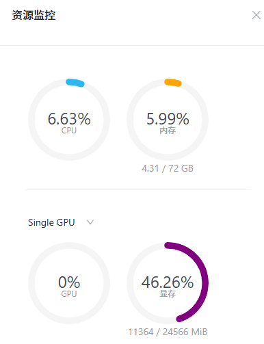

# LMDeploy 量化部署进阶实践

<!-- 进度：完成 -->

## 1. 基础任务

### 1.1. 任务描述

- 使用结合W4A16量化与kv cache量化的internlm2_5-1_8b-chat模型封装本地API并与大模型进行一次对话，作业截图需包括显存占用情况与大模型回复，参考4.1 API开发(优秀学员必做)，请注意2.2.3节与4.1节应使用作业版本命令。
- 使用Function call功能让大模型完成一次简单的"加"与"乘"函数调用，作业截图需包括大模型回复的工具调用情况，参考4.2 Function call(选做)

## 2. 复现步骤

### 2.1. lmdeploy 环境准备

#### 2.1.1. 安装其他依赖包

```bash
# 安装其他依赖包
conda create -n lmdeploy  python=3.10 -y
conda activate lmdeploy
conda install pytorch==2.1.2 torchvision==0.16.2 torchaudio==2.1.2 pytorch-cuda=12.1 -c pytorch -c nvidia -y
pip install timm==1.0.8 openai==1.40.3 lmdeploy[all]==0.5.3
```

- 结果截图


#### 2.1.2. 链接模型

```bash
# 链接模型
mkdir /root/models
ln -s /root/share/new_models/Shanghai_AI_Laboratory/internlm2_5-7b-chat /root/models
ln -s /root/share/new_models/Shanghai_AI_Laboratory/internlm2_5-1_8b-chat /root/models
ln -s /root/share/new_models/OpenGVLab/InternVL2-26B /root/models
```

- 结果截图


#### 2.1.3. 启动internlm2_5-1_8b-chat

```bash
conda activate lmdeploy
lmdeploy chat /root/models/internlm2_5-1_8b-chat
```

- 输入“请你帮我生成一个以狐狸和西瓜为主角的小故事”

- 结果截图


- 显存占用情况（为21.6GB）


### 2.2. API链接测试

#### 2.2.1. 启动API服务器

```bash
conda activate lmdeploy
lmdeploy serve api_server \
    /root/models/internlm2_5-7b-chat \
    --model-format hf \
    --quant-policy 0 \
    --server-name 0.0.0.0 \
    --server-port 23333 \
    --tp 1
```

- 终端结果截图


- 浏览器结果截图


#### 2.2.2. 以Gradio网页形式连接API服务器

```bash
lmdeploy serve gradio http://localhost:23333 \
    --server-name 0.0.0.0 \
    --server-port 6006
```

- 终端结果截图


- 浏览器结果截图


### 2.3. 启用2.2.4 W4A16 量化+ KV cache+KV cache 量化

#### 2.3.1. 启用 W4A16 量化

```bash
lmdeploy lite auto_awq \
   /root/models/internlm2_5-1_8b-chat \
  --calib-dataset 'ptb' \
  --calib-samples 128 \
  --calib-seqlen 2048 \
  --w-bits 4 \
  --w-group-size 128 \
  --batch-size 1 \
  --search-scale False \
  --work-dir /root/models/internlm2_5-1_8b-chat-w4a16-4bit
```

- 可以注意到对应目录`/root/models/`出现了量化后的模型`internlm2_5-1_8b-chat-w4a16-4bit`，`du -sh *`结果截图如下：


- 可见量化后大小为1.5G，原模型大小截图：


- 原模型的大小为3.6G，量化后大小为1.5G，压缩了58.3%。

- 输入`lmdeploy chat /root/models/internlm2_5-7b-chat-w4a16-4bit/ --model-format awq`，启动量化后的模型，观察量化后模型的显存占用情况。


- 显存占用情况约为21.1GB。通过对比，减少了0.5GB显存占用。显存占用比例如下：
- internlm2_5-7b-chat-w4a16-4bit: 1.5G
- kv cache占用：(24-1.5)*0.8=18.8G
- 其他项占用：1.0G
- 总和可见与实际占用情况大致相符。

#### 2.3.2. 使用 W4A16 量化后的模型启用 KV cache+KV cache 量化

- 输入一下命令启用KV cache+KV cache 量化，注意模型选取的是量化后的`internlm2_5-1_8b-chat-w4a16-4bit`：

```bash
lmdeploy serve api_server \
    /root/models/internlm2_5-1_8b-chat-w4a16-4bit/ \
    --model-format awq \
    --quant-policy 4 \
    --cache-max-entry-count 0.4\
    --server-name 0.0.0.0 \
    --server-port 23333 \
    --tp 1
```

- 显存占用情况展示：



- 显存占用情况约为11.9GB。通过对比，减少了9.2GB显存占用。显存占用比例如下：
- internlm2_5-7b-chat-w4a16-4bit大小：1.5G
- kv cache占用：(24-1.5)*0.4=8.6G
- 其他项占用：1G
- 总和可见与实际占用情况大致相符。
- 接下来尝试对话，输入“帮我生成一段以狐狸的西瓜为主角的小故事”。结果截图如下：


### 2.4. 在程序中调用api对话

- 输入`touch /root/internlm2_5.py`创建代码文件`internlm2_5.py`，编辑代码如下：

```python
# 导入openai模块中的OpenAI类，这个类用于与OpenAI API进行交互
from openai import OpenAI


# 创建一个OpenAI的客户端实例，需要传入API密钥和API的基础URL
client = OpenAI(
    api_key='YOUR_API_KEY',  
    # 替换为你的OpenAI API密钥，由于我们使用的本地API，无需密钥，任意填写即可
    base_url="http://0.0.0.0:23333/v1"  
    # 指定API的基础URL，这里使用了本地地址和端口
)

# 调用client.models.list()方法获取所有可用的模型，并选择第一个模型的ID
# models.list()返回一个模型列表，每个模型都有一个id属性
model_name = client.models.list().data[0].id

# 使用client.chat.completions.create()方法创建一个聊天补全请求
# 这个方法需要传入多个参数来指定请求的细节
response = client.chat.completions.create(
  model=model_name,  
  # 指定要使用的模型ID
  messages=[  
  # 定义消息列表，列表中的每个字典代表一个消息
    {"role": "system", "content": "你是一个友好的小助手，负责解决问题."},  
    # 系统消息，定义助手的行为
    {"role": "user", "content": "帮我讲述一个关于狐狸和西瓜的小故事"},  
    # 用户消息，询问时间管理的建议
  ],
    temperature=0.8,  
    # 控制生成文本的随机性，值越高生成的文本越随机
    top_p=0.8  
    # 控制生成文本的多样性，值越高生成的文本越多样
)

# 打印出API的响应结果
print(response.choices[0].message.content)
```

- 运行代码，结果截图如下：


### 2.5. Function call

- 输入`touch /root/internlm2_5_func.py`创建代码文件`internlm2_5_func.py`，编辑代码如下(由于使用教程中的输入`compute (3+5)*2`不输出正常结果，改为`use tool to compute (3+5)*2`输出正常结果)：

```python
from openai import OpenAI


def add(a: int, b: int):
    return a + b


def mul(a: int, b: int):
    return a * b


tools = [{
    'type': 'function',
    'function': {
        'name': 'add',
        'description': 'Compute the sum of two numbers',
        'parameters': {
            'type': 'object',
            'properties': {
                'a': {
                    'type': 'int',
                    'description': 'A number',
                },
                'b': {
                    'type': 'int',
                    'description': 'A number',
                },
            },
            'required': ['a', 'b'],
        },
    }
}, {
    'type': 'function',
    'function': {
        'name': 'mul',
        'description': 'Calculate the product of two numbers',
        'parameters': {
            'type': 'object',
            'properties': {
                'a': {
                    'type': 'int',
                    'description': 'A number',
                },
                'b': {
                    'type': 'int',
                    'description': 'A number',
                },
            },
            'required': ['a', 'b'],
        },
    }
}]
messages = [{'role': 'user', 'content': 'use tool to compute (3+5)*2'}]

client = OpenAI(api_key='YOUR_API_KEY', base_url='http://0.0.0.0:23333/v1')
model_name = client.models.list().data[0].id
response = client.chat.completions.create(
    model=model_name,
    messages=messages,
    temperature=0.8,
    top_p=0.8,
    stream=False,
    tools=tools)
print(response)
func1_name = response.choices[0].message.tool_calls[0].function.name
func1_args = response.choices[0].message.tool_calls[0].function.arguments
func1_out = eval(f'{func1_name}(**{func1_args})')
print(func1_out)

messages.append({
    'role': 'assistant',
    'content': response.choices[0].message.content
})
messages.append({
    'role': 'environment',
    'content': f'3+5={func1_out}',
    'name': 'plugin'
})
response = client.chat.completions.create(
    model=model_name,
    messages=messages,
    temperature=0.8,
    top_p=0.8,
    stream=False,
    tools=tools)
print(response)
func2_name = response.choices[0].message.tool_calls[0].function.name
func2_args = response.choices[0].message.tool_calls[0].function.arguments
func2_out = eval(f'{func2_name}(**{func2_args})')
print(func2_out)
```

- 运行代码，结果截图如下：


