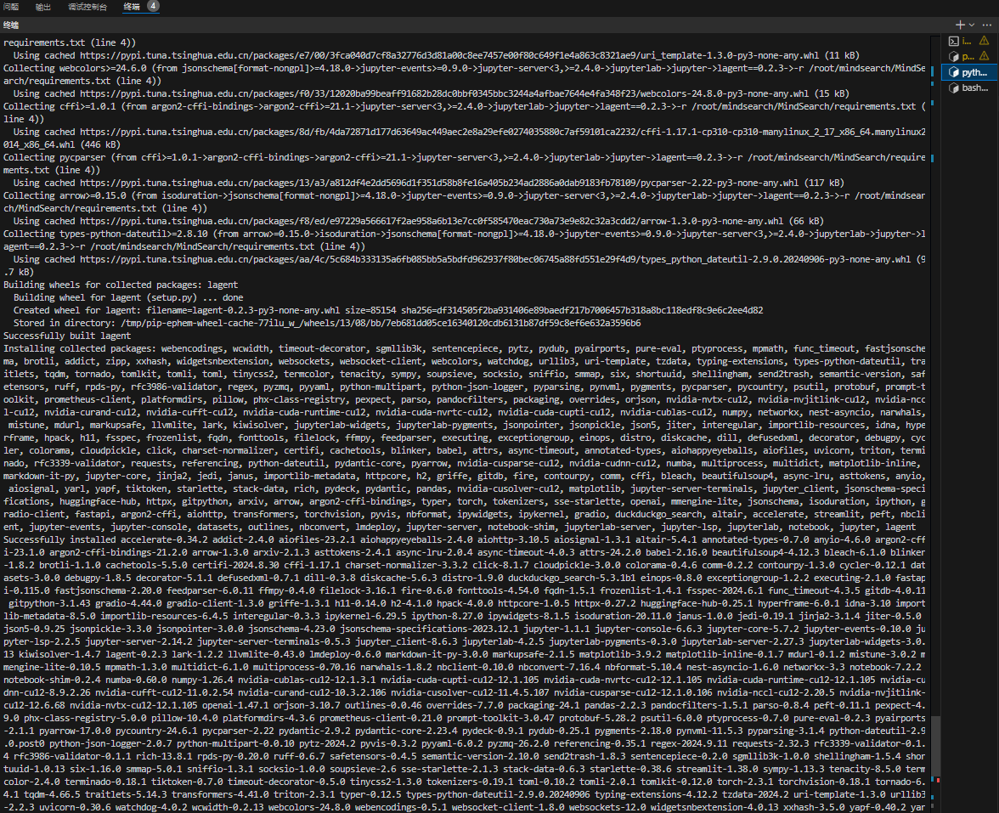
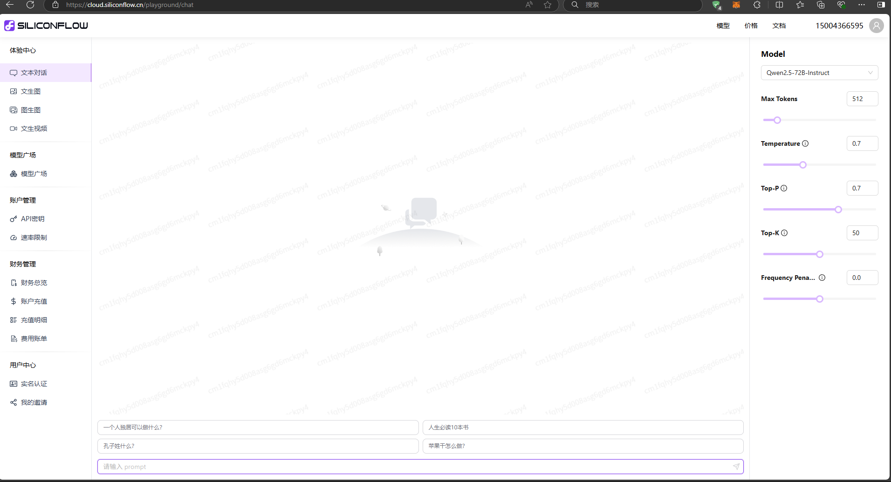
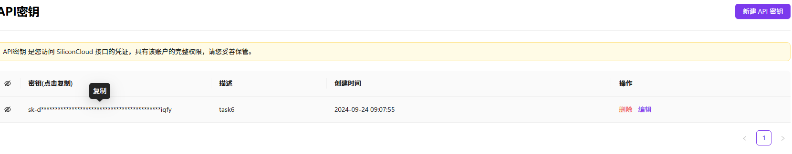
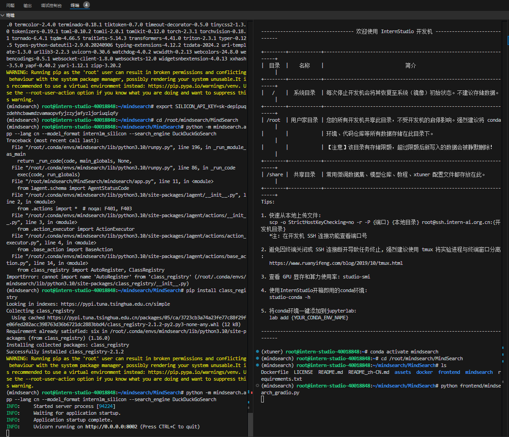
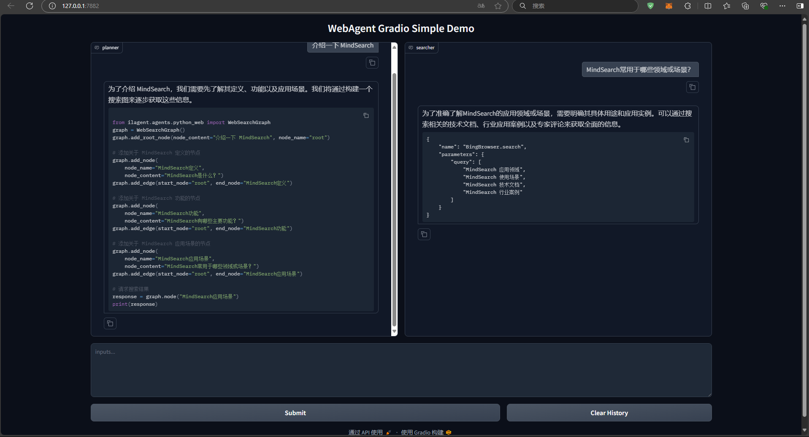
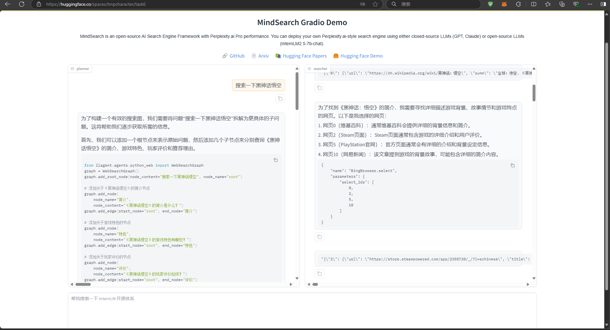

# MindSearch 快速部署

<!-- 进度：完成 -->

## 1. 任务概述

- 按照教程，将 MindSearch 部署到 HuggingFace 并美化 Gradio 的界面，并提供截图和 Hugging Face 的Space的链接。

## 2. 环境搭建

### 2.1. 代码获取

- 在终端中输入以下命令存放 MindSearch 的相关代码：

```bash
mkdir -p /root/mindsearch
cd /root/mindsearch
git clone https://github.com/InternLM/MindSearch.git
cd MindSearch && git checkout b832275 && cd ..
```

### 2.2. 环境配置

- 在终端中输入以下命令配置环境：

```bash
# 创建环境
conda create -n mindsearch python=3.10 -y
# 激活环境
conda activate mindsearch
# 安装依赖
pip install -r /root/mindsearch/MindSearch/requirements.txt
```

- 结果截图



## 3. 获取硅基流动 API Key

### 3.1. 注册硅基流动账号

打开 [siliconflow](https://account.siliconflow.cn/login) 来注册硅基流动的账号



### 3.2. 获取 API Key

打开 [硅基流动](https://cloud.siliconflow.cn/account/ak) ，选择 API Key，点击创建 API Key，将 API Key 复制下来。



## 4. 部署 MindSearch

### 4.1. 启动后端

- 在终端中输入以下命令启动后端：

```bash
export SILICON_API_KEY=第二步中复制的密钥
conda activate mindsearch
cd /root/mindsearch/MindSearch
python -m mindsearch.app --lang cn --model_format internlm_silicon --search_engine DuckDuckGoSearch
```

### 4.2. 启动前端

- 在终端中输入以下命令启动前端：

```bash
conda activate mindsearch
cd /root/mindsearch/MindSearch
python frontend/mindsearch_gradio.py
```

- 终端输出



- 结果截图



## 5. 部署到 HuggingFace Space

### 5.1. 启动 HuggingFace Space

- 打开 [huggingface](https://huggingface.co/spaces) ，并点击 Create new Space，Space name 填写 License，选择配置为 Gradio，Blank，`CPU basic · 2 vCPU · 16GB · FREE`。

- 进入 Settings，配置硅基流动的 API Key，选择 New secrets，name 一栏输入 SILICON_API_KEY，value 一栏输入我的 API Key 的内容。

- 新建目录，准备提交到 HuggingFace Space 的全部文件。

```bash
# 创建新目录
mkdir -p /workspaces/mindsearch/mindsearch_deploy
# 准备复制文件
cd /workspaces/mindsearch
cp -r /workspaces/mindsearch/MindSearch/mindsearch /workspaces/mindsearch/mindsearch_deploy
cp /workspaces/mindsearch/MindSearch/requirements.txt /workspaces/mindsearch/mindsearch_deploy
# 创建 app.py 作为程序入口
touch /workspaces/mindsearch/mindsearch_deploy/app.py
```

- 编辑 app.py 文件，将以下内容复制进去：

```python
import json
import os

import gradio as gr
import requests
from lagent.schema import AgentStatusCode

os.system("python -m mindsearch.app --lang cn --model_format internlm_silicon &")

PLANNER_HISTORY = []
SEARCHER_HISTORY = []


def rst_mem(history_planner: list, history_searcher: list):
    '''
    Reset the chatbot memory.
    '''
    history_planner = []
    history_searcher = []
    if PLANNER_HISTORY:
        PLANNER_HISTORY.clear()
    return history_planner, history_searcher


def format_response(gr_history, agent_return):
    if agent_return['state'] in [
            AgentStatusCode.STREAM_ING, AgentStatusCode.ANSWER_ING
    ]:
        gr_history[-1][1] = agent_return['response']
    elif agent_return['state'] == AgentStatusCode.PLUGIN_START:
        thought = gr_history[-1][1].split('```')[0]
        if agent_return['response'].startswith('```'):
            gr_history[-1][1] = thought + '\n' + agent_return['response']
    elif agent_return['state'] == AgentStatusCode.PLUGIN_END:
        thought = gr_history[-1][1].split('```')[0]
        if isinstance(agent_return['response'], dict):
            gr_history[-1][
                1] = thought + '\n' + f'```json\n{json.dumps(agent_return["response"], ensure_ascii=False, indent=4)}\n```'  # noqa: E501
    elif agent_return['state'] == AgentStatusCode.PLUGIN_RETURN:
        assert agent_return['inner_steps'][-1]['role'] == 'environment'
        item = agent_return['inner_steps'][-1]
        gr_history.append([
            None,
            f"```json\n{json.dumps(item['content'], ensure_ascii=False, indent=4)}\n```"
        ])
        gr_history.append([None, ''])
    return


def predict(history_planner, history_searcher):

    def streaming(raw_response):
        for chunk in raw_response.iter_lines(chunk_size=8192,
                                             decode_unicode=False,
                                             delimiter=b'\n'):
            if chunk:
                decoded = chunk.decode('utf-8')
                if decoded == '\r':
                    continue
                if decoded[:6] == 'data: ':
                    decoded = decoded[6:]
                elif decoded.startswith(': ping - '):
                    continue
                response = json.loads(decoded)
                yield (response['response'], response['current_node'])

    global PLANNER_HISTORY
    PLANNER_HISTORY.append(dict(role='user', content=history_planner[-1][0]))
    new_search_turn = True

    url = 'http://localhost:8002/solve'
    headers = {'Content-Type': 'application/json'}
    data = {'inputs': PLANNER_HISTORY}
    raw_response = requests.post(url,
                                 headers=headers,
                                 data=json.dumps(data),
                                 timeout=20,
                                 stream=True)

    for resp in streaming(raw_response):
        agent_return, node_name = resp
        if node_name:
            if node_name in ['root', 'response']:
                continue
            agent_return = agent_return['nodes'][node_name]['detail']
            if new_search_turn:
                history_searcher.append([agent_return['content'], ''])
                new_search_turn = False
            format_response(history_searcher, agent_return)
            if agent_return['state'] == AgentStatusCode.END:
                new_search_turn = True
            yield history_planner, history_searcher
        else:
            new_search_turn = True
            format_response(history_planner, agent_return)
            if agent_return['state'] == AgentStatusCode.END:
                PLANNER_HISTORY = agent_return['inner_steps']
            yield history_planner, history_searcher
    return history_planner, history_searcher


with gr.Blocks() as demo:
    gr.HTML("""<h1 align="center">MindSearch Gradio Demo</h1>""")
    gr.HTML("""<p style="text-align: center; font-family: Arial, sans-serif;">MindSearch is an open-source AI Search Engine Framework with Perplexity.ai Pro performance. You can deploy your own Perplexity.ai-style search engine using either closed-source LLMs (GPT, Claude) or open-source LLMs (InternLM2.5-7b-chat).</p>""")
    gr.HTML("""
    <div style="text-align: center; font-size: 16px;">
        <a href="https://github.com/InternLM/MindSearch" style="margin-right: 15px; text-decoration: none; color: #4A90E2;">🔗 GitHub</a>
        <a href="https://arxiv.org/abs/2407.20183" style="margin-right: 15px; text-decoration: none; color: #4A90E2;">📄 Arxiv</a>
        <a href="https://huggingface.co/papers/2407.20183" style="margin-right: 15px; text-decoration: none; color: #4A90E2;">📚 Hugging Face Papers</a>
        <a href="https://huggingface.co/spaces/internlm/MindSearch" style="text-decoration: none; color: #4A90E2;">🤗 Hugging Face Demo</a>
    </div>
    """)
    with gr.Row():
        with gr.Column(scale=10):
            with gr.Row():
                with gr.Column():
                    planner = gr.Chatbot(label='planner',
                                         height=700,
                                         show_label=True,
                                         show_copy_button=True,
                                         bubble_full_width=False,
                                         render_markdown=True)
                with gr.Column():
                    searcher = gr.Chatbot(label='searcher',
                                          height=700,
                                          show_label=True,
                                          show_copy_button=True,
                                          bubble_full_width=False,
                                          render_markdown=True)
            with gr.Row():
                user_input = gr.Textbox(show_label=False,
                                        placeholder='帮我搜索一下 InternLM 开源体系',
                                        lines=5,
                                        container=False)
            with gr.Row():
                with gr.Column(scale=2):
                    submitBtn = gr.Button('Submit')
                with gr.Column(scale=1, min_width=20):
                    emptyBtn = gr.Button('Clear History')

    def user(query, history):
        return '', history + [[query, '']]

    submitBtn.click(user, [user_input, planner], [user_input, planner],
                    queue=False).then(predict, [planner, searcher],
                                      [planner, searcher])
    emptyBtn.click(rst_mem, [planner, searcher], [planner, searcher],
                   queue=False)

demo.queue()
demo.launch(server_name='0.0.0.0',
            server_port=7860,
            inbrowser=True,
            share=True)
```

### 5.2. 提交到 HuggingFace Space

- 先建一个有写权限的token，然后从huggingface把空的代码仓库clone到开发机。

```bash
git clone https://huggingface.co/spaces/<你的名字>/<仓库名称>
# 把token挂到仓库上，让自己有写权限
git remote set-url space https://<你的名字>:<上面创建的token>@huggingface.co/spaces/<你的名字>/<仓库名称>
```

- 将准备提交到 HuggingFace Space 的全部文件复制到仓库中。提交到 HuggingFace Space。

```bash
cd <仓库名称>
# 把刚才准备的文件都copy进来
cp /workspaces/mindsearch/mindsearch_deploy/* .
# 提交到 HuggingFace Space
git add .
git commit -m "update"
git push
```

### 5.3. 测试



- 生成流程的视频

[演示视频链接](书生进阶岛通关/images/演示.mp4)

## 6. Hugging Face 的Space的链接

- [[MindSearch]https://huggingface.co/spaces/tmpcharacter/task6](https://huggingface.co/spaces/tmpcharacter/task6)
