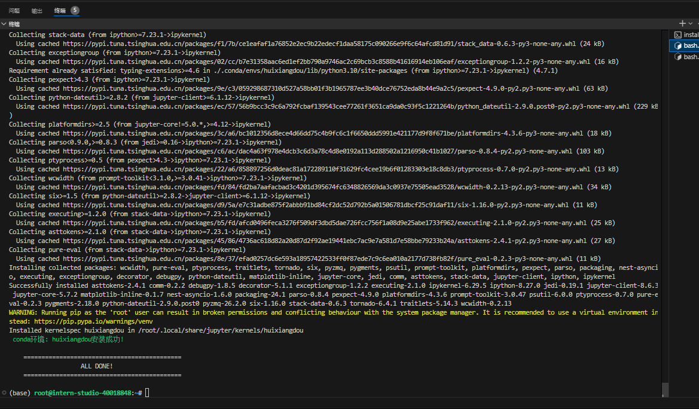
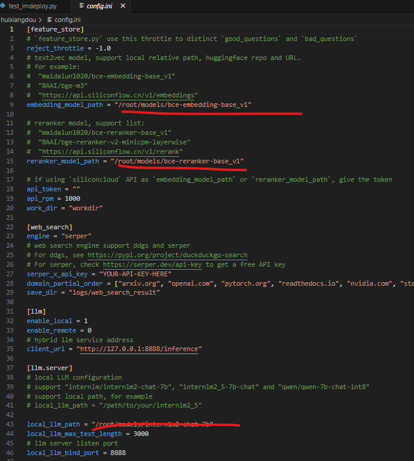
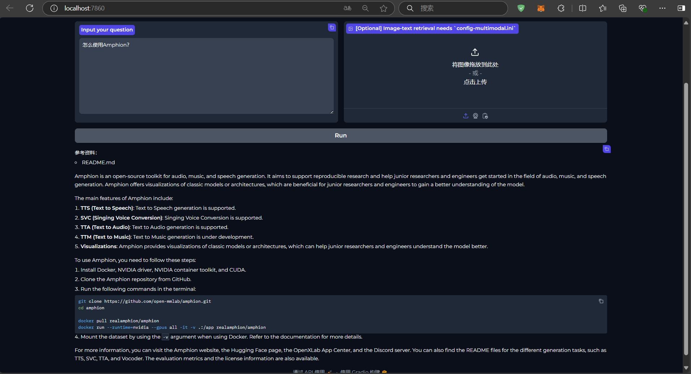

# 茴香豆：企业级知识库问答工具

<!-- 进度：无 -->

## 1. 基础任务

- 在 InternStudio 中利用 Internlm2-7b 搭建标准版茴香豆知识助手，并使用 Gradio 界面完成 2 轮问答（问题不可与教程重复，作业截图需包括 gradio 界面问题和茴香豆回答）。知识库可根据根据自己工作、学习或感兴趣的内容调整，如金融、医疗、法律、音乐、动漫等（优秀学员必做）。

## 2. 挑战任务

- 在 Web 版茴香豆中创建自己的问答知识助手，并完成微信群或飞书群的部署，在群内与茴香豆助手完成至少 1 轮问答（作业截图需包括问题和茴香豆回答）。

## 3. 环境搭建

### 3.1. conda环境搭建

```bash
studio-conda -o internlm-base -t huixiangdou
conda activate huixiangdou
```

- 结果截图



### 3.2. 安装茴香豆

```bash
cd /root
# 克隆代码仓库
git clone https://github.com/internlm/huixiangdou && cd huixiangdou
git checkout 79fa810

# 安装依赖
conda activate huixiangdou
# parsing `word` format requirements
apt update
apt install python-dev libxml2-dev libxslt1-dev antiword unrtf poppler-utils pstotext tesseract-ocr flac ffmpeg lame libmad0 libsox-fmt-mp3 sox libjpeg-dev swig libpulse-dev
# python requirements
pip install BCEmbedding==0.15 cmake==3.30.2 lit==18.1.8 sentencepiece==0.2.0 protobuf==5.27.3 accelerate==0.33.0
pip install -r requirements.txt
# python3.8 安装 faiss-gpu 而不是 faiss
```

### 3.3. 下载模型文件

```bash
# 创建模型文件夹
cd /root && mkdir models

# 复制BCE模型
ln -s /root/share/new_models/maidalun1020/bce-embedding-base_v1 /root/models/bce-embedding-base_v1
ln -s /root/share/new_models/maidalun1020/bce-reranker-base_v1 /root/models/bce-reranker-base_v1

# 复制大模型参数（下面的模型，根据作业进度和任务进行**选择一个**就行）
ln -s /root/share/new_models/Shanghai_AI_Laboratory/internlm2-chat-7b /root/models/internlm2-chat-7b
```

- 更改配置文件，让茴香豆使用本地模型

```bash
sed -i '9s#.*#embedding_model_path = "/root/models/bce-embedding-base_v1"#' /root/huixiangdou/config.ini
sed -i '15s#.*#reranker_model_path = "/root/models/bce-reranker-base_v1"#' /root/huixiangdou/config.ini
sed -i '43s#.*#local_llm_path = "/root/models/internlm2-chat-7b"#' /root/huixiangdou/config.ini
```

- 修改后文件截图



### 3.4. 知识库创建

```bash
conda activate huixiangdou

cd /root/huixiangdou && mkdir repodir

git clone https://github.com/internlm/huixiangdou --depth=1 repodir/huixiangdou
git clone https://github.com/open-mmlab/mmpose    --depth=1 repodir/mmpose

# Save the features of repodir to workdir, and update the positive and negative example thresholds into `config.ini`
mkdir workdir
python3 -m huixiangdou.service.feature_store
```

## 4. 测试知识助手

- 启动茴香豆服务

```bash
conda activate huixiangdou
cd /root/huixiangdou
python3 -m huixiangdou.main --standalone
```

- 结果截图


- 启动 UI 界面

```bash
conda activate huixiangdou
cd /root/huixiangdou
python3 -m huixiangdou.gradio
```

- 结果截图


